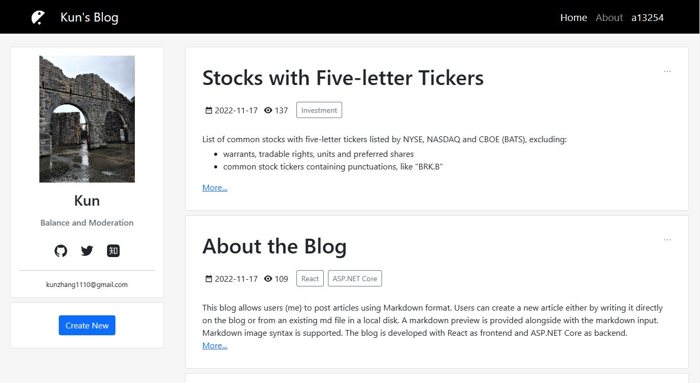
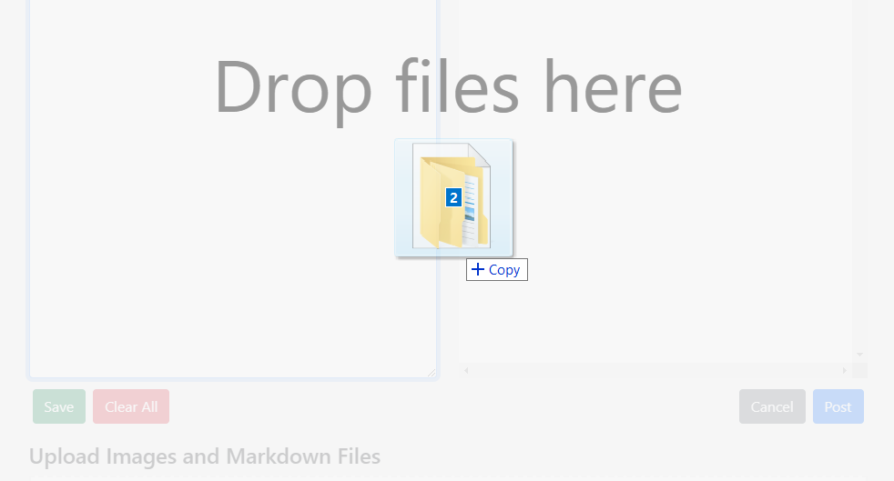
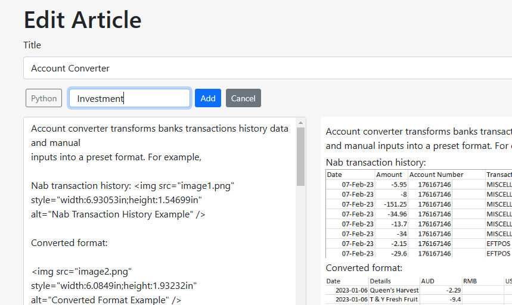

# My Blog

This repository contains the source code for my personal blog, which
uses ASP.NET Core as backend and React.js as frontend. The blog allows
users to create new articles in Markdown format with embedded images,
either by writing it on the web page or uploading existing Markdown file
through drag and drop.

Access the website at <https://myblog20230101.azurewebsites.net/>

## Getting Started

Clone the repository and run in development mode in Visual Studio.

### Testing Accounts

Use the following accounts to log in. An administrator user can create
or update products while a normal user cannot.

| **Username** | **Email**   | **Password** | **Role**      |
|--------------|-------------|--------------|---------------|
| a            | a@a.com     | Zk000000!    | User          |
| admin        | admin@a.com | Zk000000!    | Administrator |

## Description

### Create and Edit Articles

To easily create or edit an article, a user can follow the steps below:

1.  Log into the application and go to Create or Edit page.

2.  Drag Markdown file AND images folder together and drop onto the
    page.

>  style="width:6.30677in;height:3.39739in"
> alt="Graphical user interface, application Description automatically generated" />

3.  When texts and images are uploaded, click an image’s names, the
    corresponding markdown for inserting the image will be copied onto
    users’ clipboard.

### Markdown Format

GitHub Flavored Markdown (gfm) is chosen as the dialect for Markdown
format. Code snippets, math equations and raw html tags are also
supported.

### Other Features

- Users can download written markdown text by clicking “Save” button.

- Clicking image names copy image name in markdown format, such as
  `, `to clipboard.

- Abstract of articles are loaded and displayed initially, full articles
  can be fetched and displayed by clicking “more” button. The full
  articles can be collapsed.

- Clicking tags will filter articles by tags’ names.

- Clicking sidebar’s email address will copy it to clipboard.

- Users can choose to be “stayed logged in.”

## Technologies Used

Backend - ASP.NET Core

Frontend - React

- reactstrap

- react-dropzone

- React Router

- react-markdown

- remark: transform markdown format to HTML

- rehype: transform origin HTML to modified HTML
