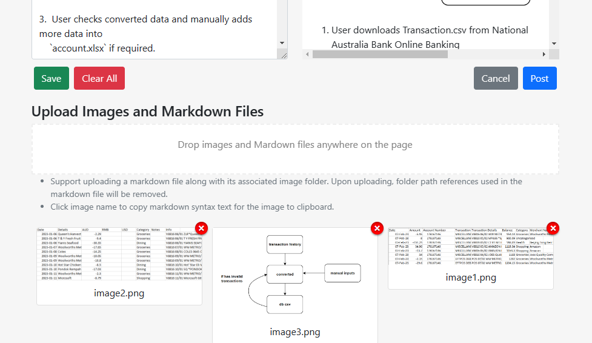

# My Blog

This repository contains the source code for my personal blog. The blog
application allows users to write, post and manages articles. A new
article can be created either by writing it directly in Markdown format,
or by uploading an existing Markdown file. A Markdown preview is
provided alongside with the markdown input, making it easier for users
to write or edit. Markdown images syntax is supported so that users can
upload a Markdown file with accompanied images together.

The blog is developed with React as frontend and ASP.NET Core as
backend.

## Getting Started

Clone the repository and run in development mode in Visual Studio.

## Description

### Create and Edit Articles

To create or edit an article, a user can follow the steps below:

1.  Log into the application and go to Create or Edit page.

2.  Drag Markdown file and images folder together and drop onto the
    page.

>  style="width:6.08941in;height:3.2803in"
> alt="Graphical user interface, application Description automatically generated" />

3.  When texts and images are uploaded, add tags if required.

4.  Check if images are well-displayed, add/change images if required.

5.  Post the article.

It may come handy to use *pandoc* to convert articles in .docx to .md
and extract embedded images. An example of pandoc command can be:

    pandoc ./README.docx –to=gfm -o README.md –extract-media=_readme

Note:

- Users can download written markdown text by clicking “Save” button.

- Clicking image names copy image name in markdown format, such as
  `, `to clipboard.

### Markdown Format

GitHub Flavored Markdown (gfm) is chosen as the dialect for Markdown
format. Code snippets, math equations and raw html tags are also
supported.

### Security

A user needs to be logged in as administrator to be able to perform CRUD
operations.

### Other Features

- Abstract of articles are loaded and displayed initially, full articles
  can be fetched and displayed by clicking “more” button. The full
  articles can be collapsed.

- Clicking tags will filter articles by tags’ names.

- Clicking sidebar’s email address will copy it to clipboard.

- Users can choose to be “stayed logged in.”

## 

Technologies Used

- React 17.0.2

- ASP.NET Core 6.0.13

- .NET Packages: ASP.NET Core Identity, EF Core, etc.

- React Packages: react-markdown, react-icons, react-router, rectstrap,
  remark, rehype, etc.
